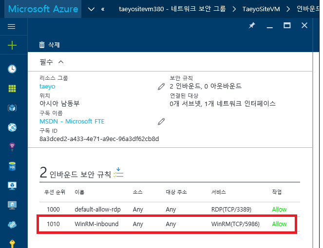
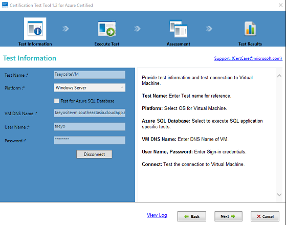

# Certification Test Tool 사용을 위한 설정

기업들이 자사의 솔루션을 Azure MarketPlace에 등록하고자 한다면 우선 해당 솔루션을 Azure VM 등에 설치한 뒤 올바로 동작하는 지를 사전에 점검해야 한다.

올바로 동작하는 지를 검증한 뒤에는 Microsoft에서 제공하는 Certification Test Tool을 사용해서 원격 VM이 등록 자격 조건에 부합한 지를 테스트해야 하는데, 테스트를 수행하기 위해서는
자사의 솔루션이 설치된 원격 VM에 Remote PowerShell 설정과 방화벽 등의 설정이 켜져 있어야 한다.

테스트 도구는 다음 경로에서 다운로드 할 수 있다.

[Certification Test Tool for Azure Certified](https://www.microsoft.com/en-us/download/details.aspx?id=44299&wa=wsignin1.0)

ASM(기존 포탈) 기반으로 구성된 VM 즉, 클래식 VM의 경우는 상대적으로 설정이 쉽지만, ARM(신규 포탈) 기반으로 구성된 VM의 경우는 그 설정이 약간 복잡하다.

해서, 다음의 컬럼들을 참고하여 이를 쉽게 설정할 수 있는 과정을 정리해 보았다.

**Remote PowerShell in Azure IAAS Virtual Machines**    
<https://blogs.msdn.microsoft.com/sriharsha/2013/10/26/remote-powershell-in-azure-iaas-virtual-machines/>

**Enabling WinRM / Remote Powershell on Azure Resource Manager Windows OS VMs**    
<http://blog.ricardovillalobos.com/?p=1871>

Certification 대상인 원격 VM과 Azure 포탈, 그리고 테스트를 수행하려는 로컬 PC에서의 각각의 설정은 다음과 같다. 

## Certification 검증 대상인 원격 VM에서의 설정
- ASM(클래식 VM)인 경우
    1. 포탈에서 끝점으로 5986 포트를 개방해 준다.
    
- ARM(신규 VM)인 경우
    1. [ConfigureWinRM.zip](ConfigureWinRM.zip)을 다운로드 받아서 원격 VM의 특정 폴더(예, C:\temp)에 복사한다
    2. 원격 VM에서 PowerShell 콘솔을 실행한다.
    3. 해당 폴더(C:\Temp)로 이동하여 다음과 같이 ConfigureWinRM.ps1를 실행하면서 원격 서버의 FQDN을 인자로 지정한다.
	예 :     
    ~~~
    .\ConfigureWinRM.ps1 taeyositevm.southeastasia.cloudapp.azure.com
    ~~~
    4. Azure Portal에서 해당 VM의 네트워크 보안 그룹에서 인바운드 보안 규칙으로 5986 포트를 개방한다
    

## Certification Test Tool을 실행할 로컬 PC(혹은 VM)에서의 설정
1. Certification Test Tool을 실행할 PC에서 Chrome으로 해당 URI를 5986 포트로 접근해서 임시 인증서를 확인한 다음, 로컬에 다운로드 후 설치한다(설치 시에는 반드시 Current User > Trusted Root Certification Authorities에 설치)   
    예 : https://taeyositevm.southeastasia.cloudapp.azure.com:5986
    
    
2. 로컬 PC(Certification Test Tool을 실행할 PC)에서 PowerShell 콘솔을 열고 다음 명령을 실행 
    ~~~
    Enter-PSSession -ComputerName <대상 원격 VM의 FQDN> -Port 5986 -Credential <계정명> -UseSSL
    ~~~
3. 연결이 성공하면 모든 준비는 끝났다. 이제 Certification Test Tool을 실행
    

마켓플레이스에 등록이 가능한 VM은 템플릿으로써 갖춰야 할 다양한 기본적인 조건들도 만족시켜야 하는데, 이러한 검사 목록은 다음 링크에서 확인할 수 있다.

[VM을 마켓플레이스에 올리기 전에 점검해야 할 사항들](https://github.com/taeyo/AzureIaaS/tree/master/Marketplace)

사실, 이 검사 목록은 위에서 언급한 Certification Test Tool에서 요구하는 검사 목록이기도 하다.

